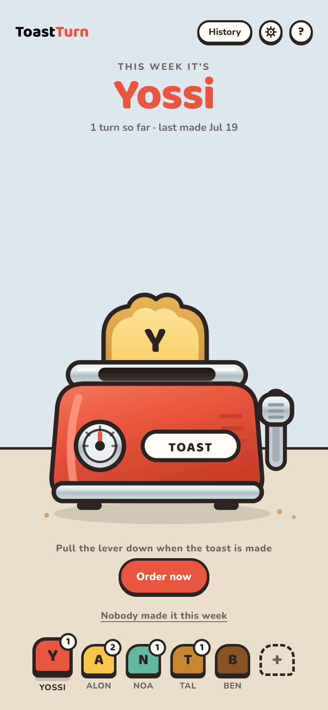
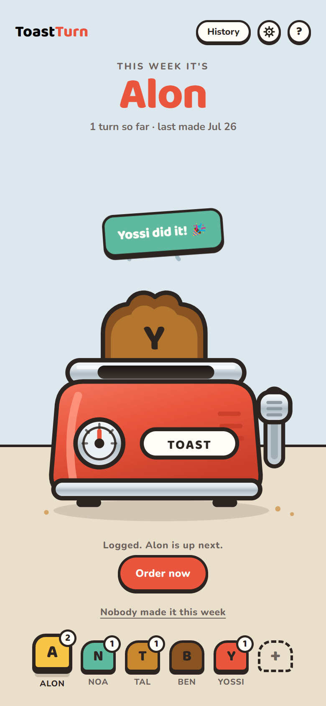
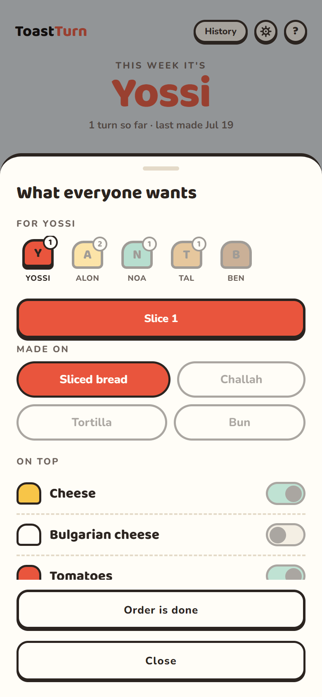
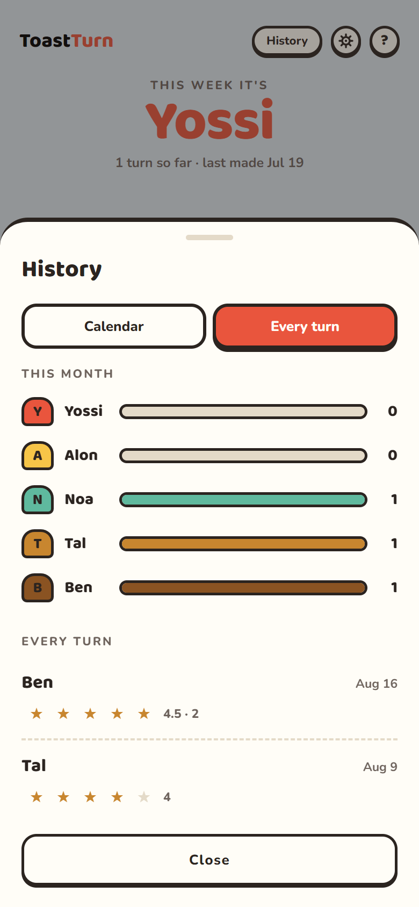
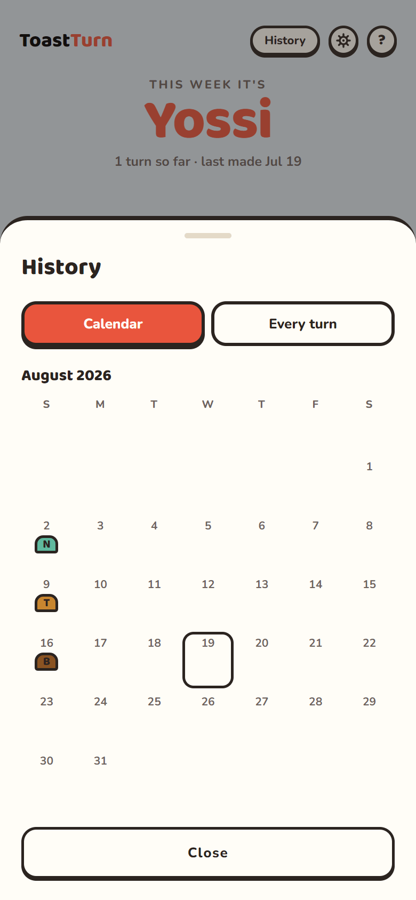
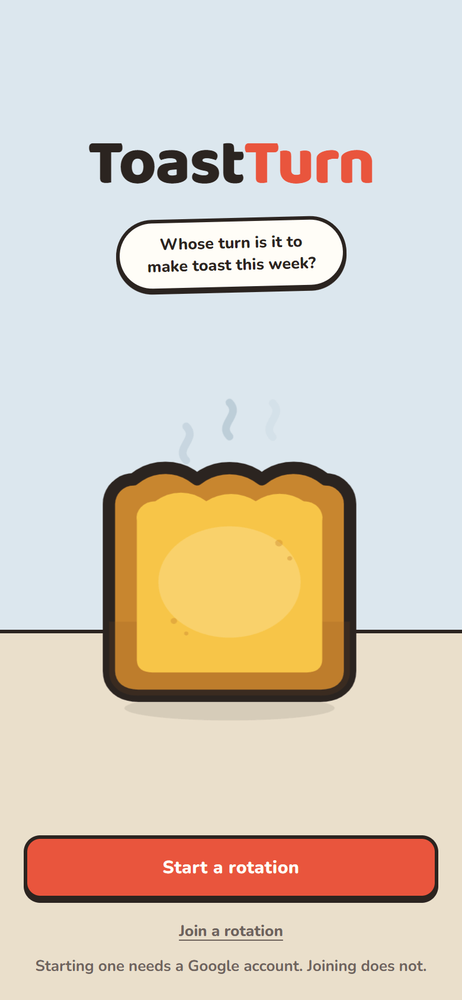
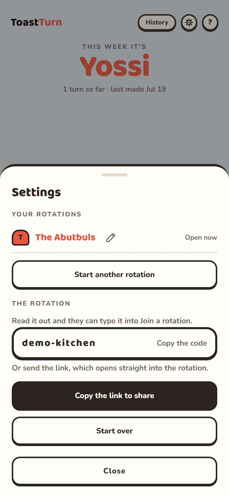

# ToastTurn

**Whose turn is it to make toast this week?**

That is the whole app. Open it and the answer is already on the screen — no
tapping, no scrolling, no logging in. When the toast is made, someone pulls the
lever and the rotation moves on.

Built for one family, used on phones, open for about eight seconds at a time.

<p align="center">
  
  
</p>

---

## What it does

### Answers the question with no taps

The name fills the screen. Underneath it, how many turns they have taken and
when the last toast was made. Along the bottom, everyone else in the order they
come up.

### Pull the lever

The toaster is the button. Drag the lever down, let go past two thirds, and the
slice drops, browns, and pops back up with the next person's initial on it.
Keyboard works too — tab to the lever, press Enter, same cycle.

Whoever is standing there can log it. The person who pulls the lever is rarely
the person who gets the credit, so the app does not stand in the way.

Nobody made toast this week? Say so, and the rotation waits where it is instead
of punishing whoever was up.

### What everyone wants

<p align="center">
  
  
  
</p>

Each person marks what they want — up to three slices, each on its own bread,
each dressed its own way, plus a short note for anything the toaster cannot say
("no crusts"). Whoever is making it sees one combined list. Tapping anyone in
the bottom queue opens their order.

### The record

A month calendar with a badge on every day toast happened, and a list of every
turn. Rate the toast one to five; everyone gets a vote and the row shows the
average. Turns per person this month sit at the top, which settles the other
argument.

### Everyone's phone, same answer

<p align="center">
  
  
</p>

Start a rotation, send the link. Everyone else opens it, taps their own name,
and they are in — no sign-up, no waiting to be approved, nothing typed. Pull the
lever on one phone and the others catch up within a second.

Only the person who started it needs an account, and only so a wiped phone
cannot take the family's rotation with it.

### Works with the wifi off

It is a real installable app. Add it to the home screen and it opens with no
browser chrome, portrait, from an icon. On the kitchen dead-spot it still shows
whose turn it is, and a turn logged with no signal goes up the moment the phone
is back.

### Small things that matter

- **Holiday mode** — switch someone off and they are skipped until they are back.
- **Reorder by hand** — move anyone earlier or later in the rotation.
- **More than one rotation** — a house and a holiday flat can both be on the phone.
- **Honours reduced motion** — the animation cuts to the result.
- **Every target is thumb-sized** and sits where a thumb reaches.

---

## Running it

```bash
npm install
npm run dev
```

Sync between phones is optional: with no Firebase keys the app runs local to one
phone and fully offline. See [docs/setup.md](docs/setup.md) for the keys, the
rules and deploying.

## Under the hood

React 19 + TypeScript on Vite, plain CSS with custom properties, Firestore for
sync, no router and no component library. The toaster is one hand-drawn inline
SVG.

The technical documentation lives in [docs/](docs/):

| | |
|---|---|
| [docs/architecture.md](docs/architecture.md) | How it is put together: the data model, the derived rotation, sync and identity, offline |
| [docs/setup.md](docs/setup.md) | Running it, the scripts, Firebase, the security rules, deploying |
| [docs/design.md](docs/design.md) | Tokens, type, the toaster's anatomy and its animation timings |
| [docs/prototype.html](docs/prototype.html) | The approved design, as one self-contained file. Open it and pull the lever |
| [CLAUDE.md](CLAUDE.md) | The standing constraints and the decisions behind them |
